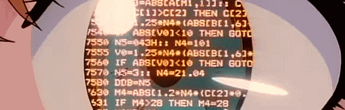

  

<h2 align="center">Привет, я Олег Семенов</h2>

## 👋 Обо мне

🐍 **Python-разработчик с фокусом на backend**

⚙️ Работаю с асинхронным Python (**FastAPI**, **Aiogram**)

🌐 Проектирую и реализую **REST APIs** и **webhook-based services**

🗄️ Использую **PostgreSQL**, **SQLAlchemy** и **Alembic**

🐳 Разворачиваю проекты с помощью **Docker** и **Docker Compose**

🔧 Интересуюсь **DevOps practices**, инфраструктурой, масштабированием, серверами и сетями

📚 Прокачиваю знания в **algorithms** и **Computer Science**

🧠 Люблю разбираться, как системы работают изнутри

🌍 Интересуюсь **Интернет-технологиями** и веб-экосистемой в целом

    

      <samp>
        <b>English version</b>
      </samp>
    

     
<h2>Hi, I`m Oleg Semenov</h2>

## 👋 About me

🐍 **Python backend developer**
⚙️ Working with async Python (**FastAPI**, **Aiogram**)
🌐 Design and build **REST APIs** and **webhook-based services**
🗄️ Use **PostgreSQL**, **SQLAlchemy**, and **Alembic**
🐳 Deploy applications using **Docker** and **Docker Compose**
🔧 Interested in **DevOps practices**, infrastructure, scalability, servers, and networking
📚 Improving skills in **algorithms** and **Computer Science**
🧠 Enjoy understanding how systems work under the hood
🌍 Interested in **Internet technologies** and the web ecosystem

<h2 align="center">🧑‍💻 Технологии и инструменты</h2>

      
       
       
      
      
      
      

 
  <h2 align="center">Достижения на Leetcode</h2>  
    

        
    

    

        
        
        
    

<h2 align="center">📱 Связаться со мной:</h2>

    
      
    
    
    

[//]: # (
)

[//]: # (  <a href="gifs/madara1.gif">)

[//]: # (    )

[//]: # (  </a>)

[//]: # (
)